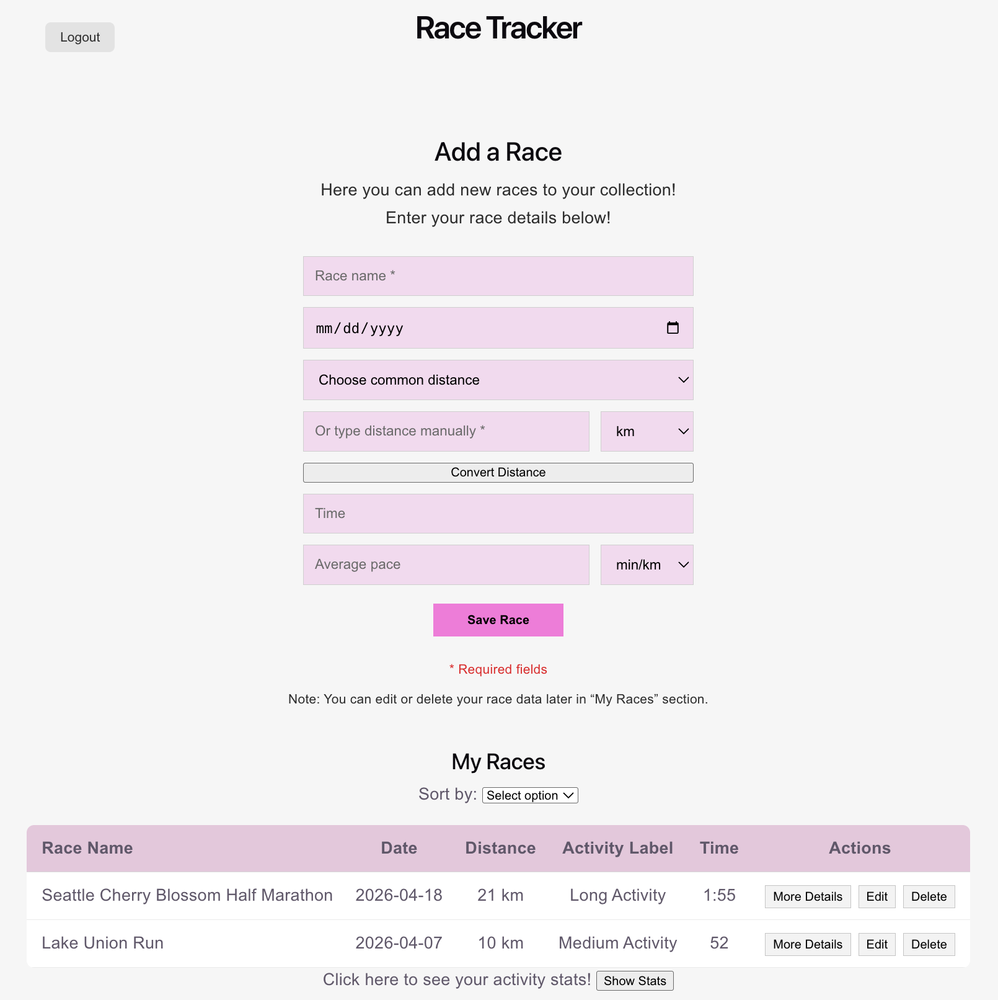
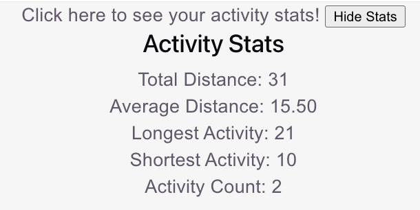
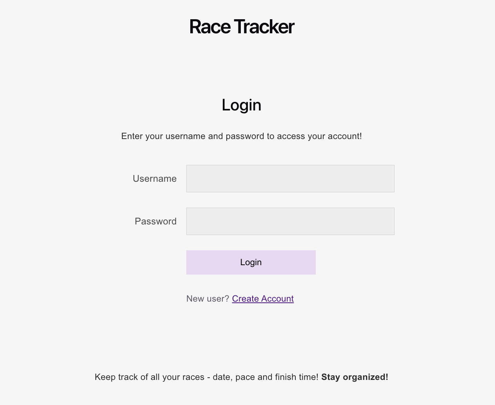

# Race Tracker

A full-stack web application for tracking running races and fitness activities using a microservice architecture.

---

## Overview

Race Tracker allows users to save, manage, and analyze their fitness activities in one place. Users can create activities, view saved races, edit or delete entries, sort activities, view activity statistics, convert units, and automatically categorize activities based on distance.

The project uses a separate frontend, backend, and multiple Flask microservices that communicate through HTTP requests and JSON responses.

---

## Features

### Main Program Features

- User login and authentication
- Add a new race or activity
- View saved races
- Edit race information
- Delete race entries
- Expand race details
- Store activity data in MongoDB

### Integrated Microservices

#### Unit Converter Microservice
- Converts distance units
- Example: kilometers ↔ miles

#### Sorting Microservice
- Sort activities by:
  - Date
  - Distance

#### Activity Stats Microservice
- Calculates:
  - Total distance
  - Average distance
  - Longest activity
  - Shortest activity
  - Activity count

#### Activity Label Microservice
- Categorizes activities as:
  - Short Activity
  - Medium Activity
  - Long Activity

---

## Tech Stack

### Frontend
- React
- Vite
- JavaScript
- CSS

### Backend
- Node.js
- Express

### Database
- MongoDB
- Mongoose

### Microservices
- Python
- Flask
- Flask-CORS

---

## Microservice Communication

The Main Program communicates with each microservice through HTTP requests using `fetch()` and JSON request/response data.

Each microservice runs independently in a separate process.

| Service | Port |
|---|---|
| Main Program Backend | 3000 |
| Unit Converter | 3001 |
| Sorting Service | 3002 |
| Activity Stats Service | 3003 |
| Activity Label Service | 3004 |

---

## Project Structure

```text
race-tracker/
├── backend/
├── frontend/
├── images/
└── README.md
```

---

## Screenshots

### Dashboard



### Activity Statistics



### Login Page



---

## Running the Project

### 1. Start the Frontend

```bash
cd frontend
npm install
npm run dev
```

Runs on:

```text
http://localhost:5173
```

---

### 2. Start the Backend

```bash
cd backend
npm install
npm start
```

Runs on:

```text
http://localhost:3000
```

---

## Microservice Repositories

Each microservice is maintained in its own repository and must be started separately.

### Unit Converter Microservice
Repository:
```text
https://github.com/elenavaiva/unit-converter
```

### Sorting Microservice
Repository:
```text
https://github.com/elenavaiva/sorting-microservice
```

### Activity Stats Microservice
Repository:
```text
https://github.com/elenavaiva/activity-stats-microservice
```

### Activity Label Microservice
Repository:
```text
https://github.com/elenavaiva/activity-label-service
```

---